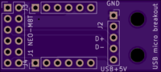
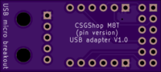

# PCB_CSGShop_M8T_USB_adapter

USB adapter for [pin version of uBlox Neo-M8T](https://www.csgshop.com/product.php?id_product=240) available from CSGShop.

The pin header on the receiver breaks out USB D-/D+, 5V and GND. These can be routed directly to a USB mini or mico connector. For ease of construction I'm using a USB micro breakout board instead of soldering a USB micro connector directly on the board.

